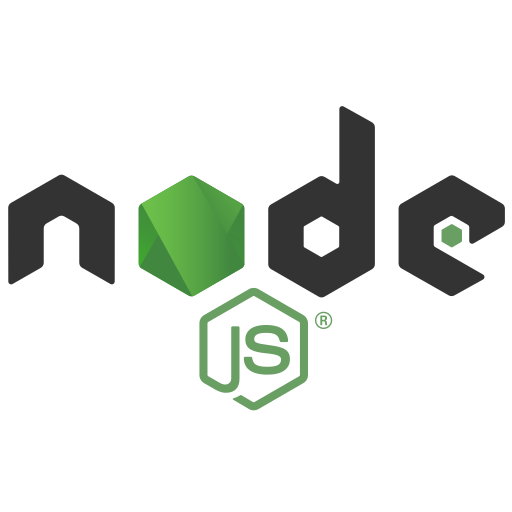

# ktrust-home-assignment

## Setup Instructions
Plaese make sure port 3000 is free.

### How to create Admin User?
Create user with the email:
```
admin@gmail.com
``` 
With any pass you want, for example :)
```
Abc1234!
``` 

and then you will get admin permissions! 
### Backend
```
cd backend
``` 
```
npm i
``` 
```
npm start
``` 
#### Then the server will print:
###### "Server started at port http://localhost:3000
###### Connected to DB"

### Frontend
```
cd frontend
``` 
```
npm i
``` 
```
npm start
``` 
#### Enjoy 😊
#### Then the React app will open.

## Links

### [Postman file](https://drive.google.com/file/d/1jXxmcHDDxXo1PicyYv6JSUSiVem8LMBd/view?usp=sharing)

### [Figma file](https://www.figma.com/proto/JG4aGk1xXKP2upHyemUmuA/Untitled?type=design&node-id=27-[…]id=0%3A1&starting-point-node-id=27%3A5887&show-proto-sidebar=1)

## Technologies

### Front-end

(ReactTS, Scss, Figma, HTML)


### Back-end

(ExpressTS, MongoDB, Postman)


### Misc

(Linux-Ubuntu, Bash, Git, Jest,TypesScript, NodeJS)


